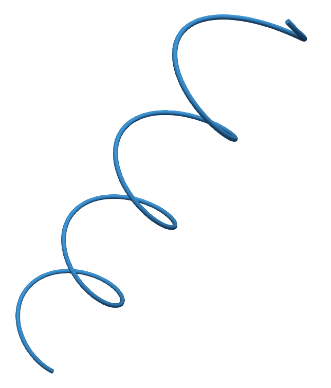

# Helix

This source generates a simple helix with used-defined length, radius and number of windings.

## Parameters

The following parameters are available in the properties panel in ParaView:

| Parameter                 | Description                                                                           | Default value |
|---------------------------|---------------------------------------------------------------------------------------|---------------|
| Number of output points   | Number of points defining the output polyline.                                        | 100           |
| Length                    | Length of the center line.                                                            | 10            |
| Radius                    | Radius of the helix, i.e., distance of all points on the helix to the center line.    | 1             |
| Number of windings        | Number of windings of the helix around the center line.                               | 2             |

## Example

Above example was created with parameters:
- Number of output points: 10000
- Length: 10
- Radius: 1
- Number of windings: 4

[ParaView state file.](helix.pvsm)
